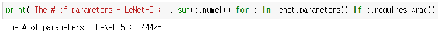
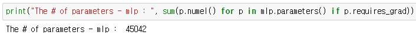
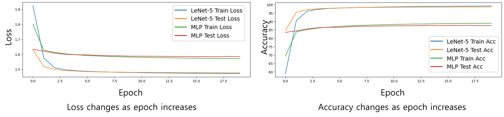
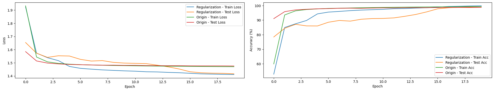
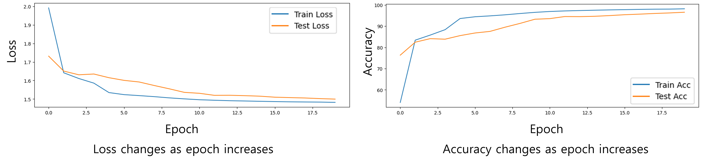
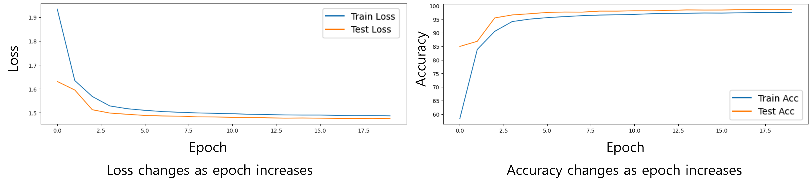
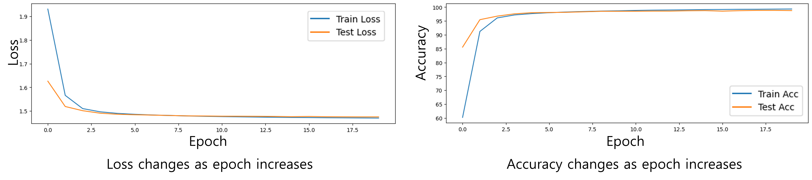

# HW2 : MNIST Classification
24510111 Boyoung Lim

* **NOTE!** The codes are the final versions with the regularization techniques applied.
## Model Implementation
### LeNet-5
The input image I used has 28x28 shape while the paper (LeCun et al., 1998) used images with 32x32 shape. For this reason, I modified the structure of LeNet-5 model: using two convolution layers, not three. Thus, my model has fewer than the original model, about 60,000 parameters. The number of model parameters is as follows:

- Figure 1. The number of parameters of LeNet-5 model.


The number of parameters is computed as follows:
1. Convolution layers
- 1st layer : (5 × 5 × 1× 6) + 6 = 156
- 2nd layer : (5 x 5 x 6 x 16) + 16 = 2416

2. Fully connected layers:
- 1st layer : (16 × 4 × 4 × 120) + 120 = 30840
- 2nd layer : (120 × 84) + 84 = 10164
- 3rd layer : (84 × 10) + 10 = 850

 Thus, the total number of parameters is 44426.

### Custom MLP model
I designed MLP model with three fully connected layers. Here, I adjusted the number of units to match the same parameter count as LeNet-5. I checked the two models have almost the same number of parameters. The number of parameters of MLP model is as follows:

- Figure 2. The number of parameters of MLP model.


The number of parameters is computed as follows:
1. Fully connected layers
- 1st layer : (28 x 28 x 56) + 56 = 43960
- 2nd layer : (56 x 16) + 16 = 912
- 3rd layer : (16 x 10) + 10 = 170

Thus, the total number of parameters is 45042.

## Performance Evaluation

### Plotting
During training and testing, the average loss values and accuracy were recorded for each epoch. I plotted each curve for LeNet-5 and the Custom MLP model on the same graph. Also, **I plotted the curve for training and test datasets on the same graph.** Thus, I had **two plots**. The learning curve and accuracy curve of the training set and test set are as follows:

- Figure 3. Comparison of two models.



### Comparing the predictive performances of LeNet-5 and the custom MLP.

First of all, LeNet-5 achieves 99.26% and 98.68% for training and test datasets at 20 epoch, respectively. This result is similar to the known accuracy.
Second, both loss and accuracy curves for both datasets show that LeNet-5 outperforms the custom MLP model. Specifically, at the final epoch, the loss value of LeNet-5 is 1.4706 and 1.4757 for training and test datasets, respectively, while that of the custom MLP model is 1.5705 and 1.5835 for training and test datasets, respectively. In addition, for each dataset, the MLP model has a maximum accuracy of about 89%, while LeNet-5 has an accuracy of over 98%. These results indicate that the LeNet-5 model classifies images better than the MLP model.

## Regularization for improving the performance.
I employed three regularizations to improve LeNet-5 model: Data augmentation, Dropout, L2 regularization. Thus, I modified ```MNIST``` class in ```dataset.py```, ```LeNet5``` class in ```model.py``` and optimizer in ```main.py```. 

Specifically, I added ```transforms.RandomHorizontalFlip(p=0.8)```, which horizontally flips the image randomly with 0.8 probability, in the transforming function of ```MNIST``` class. The modified ```MNIST``` class is applied only to training data. I defined ```MNIST2``` class, in which the augmentation is not applied, for test data. For dropout, I added a dropout layer with 0.5 probability to ```LeNet5``` class. For L2 regularization, I set weight-decay as 1e-5 of the optimizer.

I compared two versions, the original model and the model with regularization applied. For this, I plotted the loss and accuracy curves for both datasets. 
 
- Figure 4. Comparison with the model with regularization applied. 



Because the original model performs performs well enough, the modified model shows a slight performance improvement. 

For loss curve, as the epoch increases, the result indicates that the regularization techniques are effective in reducing loss. Specifically, the loss value is reduced by about 0.1 for both training and test data.

For accuracy curve, as mentioned before, because the performance of the original model is good enough, there is a slight improvement. Specifically, regularization techniques improve accuracy at 20 epoch by about 0.48% and 0.55% for training and test datasets, respectively while no regularization case shows better performance before 16~17 epochs.

In conclusion, it is evident that regularization techniques actually help improve the performance.

## Additional results of Regularization

I additionally measured the results of applying each technique. I compared each case with all three techniques and found that the performance improvement was greater when all three techniques were applied.

- Figure 5. The results with data augmentation. 



- Figure 6. The results with dropout. 



- Figure 7. The results with L2 regularization. 



